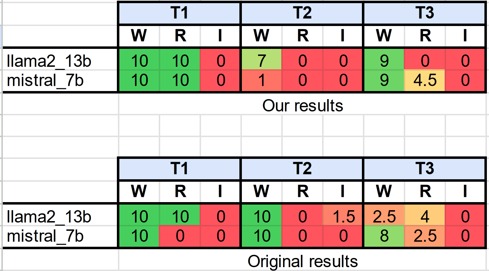

<div id="top"></div>
<!-- PROJECT LOGO -->
<br />
<div align="center">
  <a href="https://github.com/Mhackiori/LLM-SysAdmin/">
    
  </a>

  <h1 align="center">Reproducing: "Can LLMs Understand Computer Networks? Towards a Virtual System Administrator"</h1>

  <p align="center">
    Original Authors:<br /> 
    <a href="https://www.math.unipd.it/~donadel">Denis Donadel</a>
    ·
    <a href="https://www.math.unipd.it/~fmarchio/">Francesco Marchiori</a>
    ·
    <a href="https://sites.google.com/view/lucapajola/home">Luca Pajola</a>
    ·
    <a href="https://www.math.unipd.it/~conti/">Mauro Conti</a>
    <br />
    <br />
    Review Team: <br />
    Anamika Lochab
    ·
    Edoardo Stoppa
    ·
    Gabriel Buginga
    ·
    Khoa Raisr
    ·
    Linkai Ma
    ·
    Xinzhi Wang
    
  </p>
</div>

<!-- TABLE OF CONTENTS -->
<details>
  <summary><strong>Table of Contents</strong></summary>
  <ol>
    <li>
      <a href="#abstract">Original Abstract</a>
    </li>
    <li>
      <a href="#intro">Can LLMs Understand Computer Networks?</a>
    </li>
    <li>
      <a href="#premise">Some Premises</a>
    </li>
    <li>
      <a href="#reproducing">Reproducing the Study</a>
    </li>
    <li>
      <a href="#findings">Key Findings</a>
    </li>
    <li>
      <a href="#nextsteps">Reflections and Future Directions</a>
    </li>
    <li>
      <a href="#ending">Closing Thoughts</a>
    </li>

  </ol>
</details>
<br/>

<div id="abstract"></div>

# 🧩 Original Abstract

<a href="https://arxiv.org/abs/2404.12689"><strong>Preprint Available »</strong></a>

>Recent advancements in Artificial Intelligence, and particularly Large Language Models (LLMs), offer promising prospects for aiding system administrators in managing the complexity of modern networks. However, despite this potential, a significant gap exists in the literature regarding the extent to which LLMs can understand computer networks. Without empirical evidence, system administrators might rely on these models without assurance of their efficacy in performing network-related tasks accurately. In this paper, we are the first to conduct an exhaustive study on LLMs' comprehension of computer networks. We formulate several research questions to determine whether LLMs can provide correct answers when provided with a network topology and questions on it. To assess them, we developed a thorough framework for evaluating LLMs' capabilities in various network-related tasks. We evaluate our framework on multiple computer networks employing private (e.g., GPT4) and open-source (e.g., Llama2) models. Our findings demonstrate promising results, with the best model achieving an average accuracy of 79.3%. Private LLMs achieve noteworthy results in small and medium networks, while challenges persist in comprehending complex network topologies, particularly for open-source models. Moreover, we provide insight into how prompt engineering can enhance the accuracy of some tasks.

<br />

<div id="intro"></div>

# 🖥️ Exploring the Limits: Can LLMs Understand Computer Networks?

In the ever-evolving landscape of artificial intelligence, one question continues to challenge researchers: how far can large language models (LLMs) go in understanding technical domains like computer networks and networking? Our team tried to reproduce and extend the findings of the paper, *"Can LLMs Understand Computer Networks? Towards a Virtual System Administrator"*. This post dives into our methodology, findings, and the insights we uncovered about the capabilities of LLMs in a highly technical field.

<div id="premise"></div>

<br />

# 🔀 Some Premises: Testing LLMs on Computer Networks

The original study set out to explore the capacity of LLMs to comprehend computer networks. The authors created three synthetic networks of increasing complexity, described them using **NetJSON**, and evaluated multiple LLMs by asking a series of questions in a **Zero-Shot Learning (ZSL)** setting.

Another important things to remember is that, even if we manage to evaluate a few of the original LLMs (more on this later), we could obtain the exact same results as in the original work (see image below). The authors did not specify a few important parameters (like the models temperature, quantization, or revision), thus our analysis focuses more on the macro trends that the data shows.

<div align="center">
    </img>
</div>
<center>Discrepancy example between the original and our analysis</center>

## What is NetJSON?

NetJSON is a JSON-based format designed to represent network configurations. It enables the definition of:

- **Nodes**: Elements like routers, switches, servers, or hosts.
- **Links**: Connections between nodes, defining the network topology.

The original study left the links undefined in the NetJSON files, relying on subnet mask similarity to infer connectivity. This decision added an interesting dimension to the evaluation. The files that we use can be found in the ```networks``` folder.

<br />

<div id="reproducing"></div>

# 📚 Reproducing the Study

<div style="overflow: hidden; display: flex; justify-content:space-around; ">

<div style="margin-right: 2%; min-width: 45%;">

<center>

#### **Original Models**

</center>

Our first step was to reproduce the results of the original paper. Due to accessibility and deprecation issues, we couldn’t use all the original models but evaluated six comparable LLMs:

- **Llama 2 (7B)**  
- **Llama 2 (13B)**
- **Llama 3.1 (8B)**
- **Mistral Instruct v0.2 (7B)**
- **Gemma 2 (27B)**
- **GPT 4o mini**

The only 2 models that are exactly equal to the original work are: **Llama 2 (13B)** and **Mistral Instruct v0.2 (7B)**.

</div>

<div style="margin-left: 2%; min-width: 45%;">

<center>

#### **Newly Added Models**

</center>

To these 6, we added 2 other LLMs (which we consider significantly more powerful than all the others):
- **GPT 4o**  
- **OpenAI o1 preview**

Unfortunately, due to the extreme cost (in term of time and money) of prompting o1 preview, we decided to explore this model capabilities fousing only on 1 network: Intradomain. We chose this specific network because it's the most complex from the origin study, thus we could infer more interesting conclusion on the capabilities of this model.

</div>

</div>

<br />

Each task was prompted 10 times for each model and network combination, using **accuracy** as the primary evaluation metric. Answers from LLMs can be completely right (full point), partially (0.5 points), and completely wrong (0 points). Due to the fact that what consitutes a "partially correct" answer was never defined, we recognize that some variance may be caused by our different interpretation of these partially correct answers.

<br />

<div align="center">
    <div style="max-width: 30%; max-height: 30%;"></div>
</div>

</br>

### Special Parameters

In order to ensure future reproducibility, we include here the most important paramters necessary to obtain similar performances:

**Temperature**

- OpenAI models: 1.2
- All other models: 0.5

**Revisions**

- Mistral Instruct v0.2 (7B): last available revision
- LLaMa 2 family: last available revision
- LLaMa 3.1: model downloaded on 11/03/2024
- Gemma2: model downloaded on 11/02/2024
- OpenAI models: impossible to know


**Quantization**

- Mistral Instruct v0.2 (7B): 8 bit
- OpenAI Models: impossible to know
- All other models: 4 bit

<br />

## The networks

<div  style="overflow: hidden; display: flex; justify-content:space-around;">

<div style="margin-right: 2%;  min-width: 45%;">

<center>

### Original

</center>

The authors have created 3 synthetic networks that they used for their analysis. These 3 networks are of increasing complexity, and are designed to mimick possible real world networks. Specifically we have:
- **Webserver (W)**: A simple server and client interacting.
    - \# of Nodes: 2
    - Avg(Node Degree): 2
- **Routers (R)**: A few routers exchanging information.
    - \# of Nodes: 3
    - Avg(Node Degree): 1.67
- **Intradomain (I)**: A small intradomain network, with a mix of routers, switches, hosts, and servers.
    - \# of Nodes: 12
    - Avg(Node Degree): 2.67

</div>

<div style="margin-left: 2%; min-width: 45%;">

<center>

### Newly Added

</center>

We wanted to **include new topologies** in order to stress other factors. Specifically, we wanted to check what happens when a low nodes but highly dense networks is used, and a much bigger network directly inspired by a famous network architecture:
- **Datacenter (D)**: A moderately complex, densly connected datacenter.
    - \# of Nodes: 6
    - Avg(Node Degree): 3.2
- **Fat Tree (F)**: A highly complex datacenter, designed using the fat tree architecture.
    - \# of Nodes: 18
    - Avg(Node Degree): 1.55

</div>

</div>

<br/>

### With links or without?
The original analysis did not specify the links between nodes inside any NetJSON file. Instead, they encoded the connection assigning special IPs to each node, where a connection exists between 2 nodes if they have an IP with the same address mask.

<br />

We assume that this was done primarily for 2 reasons:
- Investigate if LLMs can infere these connection based on their undestanding of subnetworks and IP addressing
- Lower the amount of tokens used for each prompt to avoid any models forgetting any important information.

<br />

In our analysis we wanted to not only investigate the performance of all LLMs when these links were present, but also compare and constract the effect that these links may have on the reasoning and comprehension capabilities of the models. Thus, **we added the explicit link encoding in all netwotk files**, and prompted all models with and without links.

<br />

## The Tasks

The study's evaluation tasks were divided into four categories:

1. **Topology**: Understanding the structure of the network.
    - **T1**: How many nodes are there in the network?  
    - **T2**: How many IP addresses are assigned to each device?  
    - **T3**: Which devices have the most IP addresses assigned?

2. **Drawing**: Generating network visualizations.
    - **T4**: Create a graph of the network using either visual formats (e.g., Mermaid) or ASCII art.

3. **Addressing**: Identifying and interpreting IP-related features.
    - **T5**: Are there devices with special-purpose IP addresses?  
    - **T6**: Do devices have multiple IP addresses?  
    - **T7**: Are there IPv6 addresses?  
    - **T8**: How many subnetworks exist?  
    - **T9**: Can one subnetwork be removed without losing connectivity?  
    - **T10**: Identify the subnetwork connecting two specific nodes.

4. **Paths**: Understanding connections between nodes.
    - **T11**: Can two nodes communicate without a hop?  
    - **T12**: Similar to T11 but with nodes requiring multiple hops.

<div id="findings"></div>

<br />

# 🔑 Key Findings

<br />

## 1. Topology Understanding

The original paper suggested that LLMs perform well on small, simple networks but struggle as complexity increases. We confirmed this for the original networks:

- **Webserver (W)**: Achieved high accuracy (~86%).  
- **Routers (R)**: Moderate accuracy (~55%).  
- **Intradomain (I)**: Poor accuracy (~18%).

Interestingly, our results for the new networks revealed a **complexity threshold**:  
- **Datacenter (D)**, despite being more complex than Routers (R), showed similar accuracy (~52%).  
- **Fat Tree (F)**, the most complex network, had results on par with Intradomain (I), both at ~17%.

This suggests that beyond a certain complexity, performance stagnates regardless of additional intricacies.

<br />

## 2. Drawing Network Graphs

The original study claimed that LLMs struggled to generate meaningful visualizations. However, our results painted a different picture:

- LLMs like GPT 4o excelled in producing **Mermaid diagrams** or generating Python code for network visualization.
- Attempts at ASCII art, however, remained poor.

Example:
- **Mermaid Diagram**: Near-perfect representation of Fat Tree (F).  
- **ASCII Art**: Struggled even with simpler networks like Routers (R).

<br />

## 3. Addressing and IP Recognition

Our results confirmed that LLMs excel in identifying subnetworks and IP addresses, achieving ~90% accuracy for most tasks. However:

- Task **T5** ("special-purpose IP addresses") caused discrepancies due to vague definitions of "special."
- Proprietary models like GPT 4o consistently outperformed open-source models, but **Gemma 2** and **Llama 2 (7B)** showed competitive performance.

<br />

## 4. Path Evaluation

While the original paper reported drastic performance drops on pathfinding tasks for larger networks, we observed only moderate declines (~20%). Additionally:

- The **Llama family** excelled in pathfinding tasks, an observation absent in the original paper.

<br />

## 5. Do Explicit Links Help?

Adding explicit links in NetJSON files produced mixed results:

- **Simple networks (e.g., Webserver)**: Accuracy dropped due to over-specification.  
- **Complex networks (e.g., Fat Tree)**: Accuracy improved for most models.

GPT 4o mini particularly benefited, seeing a **10% accuracy increase** with explicit links.


<div id="nexsteps"></div>

<br />

# ⏭️ Reflections and Future Directions

<div  style="overflow: hidden; display: flex; justify-content:space-around;">

<div style="margin-right: 2%;  min-width: 45%;">

## Insights Gained
- **Complexity Thresholds**: LLMs can handle networks up to a certain complexity before performance degrades uniformly.  
- **Ambiguous Prompts**: Tasks like T5 highlight the need for clearer definitions to ensure consistent model evaluation.

</div>

<div style="margin-right: 2%;  min-width: 45%;">

## Practical Takeaways
- **Network Visualization**: Integrating Mermaid or Python-based visualizations into workflows could leverage LLM strengths.
- **Explicit Data Representation**: Explicitly defining network details may benefit applications in large-scale systems.

</div>

</div>

<br />

<div id="ending"></div>

# 🏁 Closing Remarks

Reproducing research is about more than validation; it's a pathway to deeper understanding and new discoveries. Our extended study not only confirmed many claims from the original paper but also uncovered insights about the interplay between model complexity, data representation, and task specificity.

As LLMs continue to evolve, their potential to serve as virtual system administrators grows ever more plausible. The journey to realizing this potential, however, is one of careful refinement and targeted improvements.